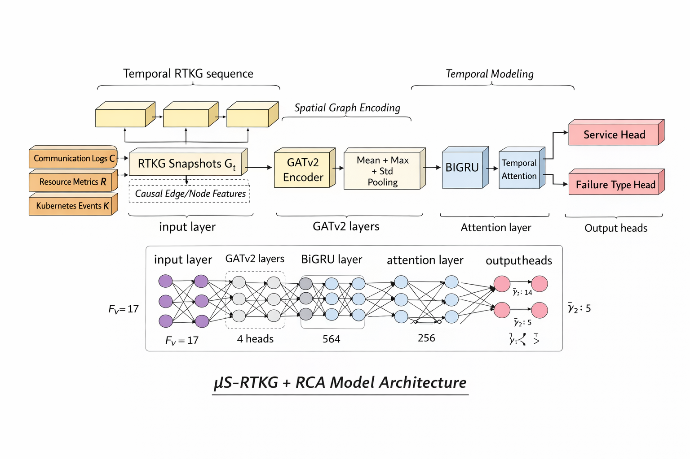

# RCA-GAT-GRU — Faulty Service and Failure Type Detection via Temporal Graph Learning

**Root Cause Analysis (RCA)** system for microservices / Kubernetes environments, combining a graph attention encoder (**GATv2**) with a temporal module (**bidirectional GRU + attention**) to identify, from sequences of inter-service call graphs, **which service is the root cause of an incident** and **what type of failure** is occurring.

The model is multi-task: it simultaneously produces a **faulty service** prediction and a **failure class** prediction, from a sliding window of communication/resource/event graphs.

---

## Table of Contents

- [Overview](#overview)
- [Model Architecture](#model-architecture)
- [Data Pipeline](#data-pipeline)
- [Repository Structure](#repository-structure)
- [Installation](#installation)
- [Input Data Format](#input-data-format)
- [Training](#training)
- [Evaluation and Inference](#evaluation-and-inference)
- [Generated Artifacts](#generated-artifacts)
- [Configuration and Hyperparameters](#configuration-and-hyperparameters)
- [License](#license)

---

## Overview

In a distributed system, an incident (abnormal latency, high error rate, throughput drop) often propagates from one service to its dependencies. This project models each **time window** of the infrastructure as a **graph**:

- **nodes** = services (pods), with resource, event, and causality features,
- **edges** = inter-service communications, with latency, throughput, error, and heuristically computed **causality score** features,
- a **sequence of consecutive graphs** (sliding window) is then encoded over time to capture the dynamics of failure propagation.

The final model answers two questions:

1. **Which service is the root cause of the incident?** (multi-class classification `y1`)
2. **What type of failure is occurring?** (multi-class classification `y2`)

---

## Model Architecture

The model (`GATGRUMultiTask`, in [`model.py`](./model.py)) is organized into four blocks: spatial per-graph encoding (GATv2), aggregation into a graph embedding, temporal encoding (BiGRU + attention), and two dedicated output heads.



*Figure — Full pipeline: communication logs, resource metrics, and Kubernetes events are assembled into a temporal sequence of graphs (RTKG snapshots `G_t`), enriched with causal node/edge features. Each graph is encoded by a 4-head `GATv2`, then aggregated via pooling (mean ‖ max ‖ std) before being passed to a `BiGRU`. A temporal attention layer summarizes the sequence, which finally feeds the two output heads (`Service Head`, `Failure Type Head`).*

Summary schematic of the dimensions involved (example with `F_v = 17` features per node):

```
input layer   →   GATv2 layers   →   BiGRU layer   →   attention layer   →   output heads
 (F_v = 17)        (4 heads)          (564)              (256)            ŷ1 : 14 | ŷ2 : 5
```

Sequential breakdown of the blocks:

```
Graph sequence [G_t0, G_t1, ..., G_t(T-1)]
        │
        ▼
┌───────────────────────┐
│   GATEncoder (GATv2)  │  → spatial encoding per graph (2 layers, residual)
│   + LayerNorm + ELU   │
└───────────┬───────────┘
            ▼
   Pooling (mean ‖ max ‖ std)   → graph embedding per time step
            ▼
┌───────────────────────┐
│  Bidirectional GRU    │  → temporal encoding of the embedding sequence
│   (2 layers)          │
└───────────┬───────────┘
            ▼
  Last hidden state ‖ Temporal attention
            ▼
        Fusion (MLP)
            ▼
     ┌──────┴──────┐
     ▼             ▼
 Service Head   Failure Head
 (MLPHead)      (MLPHead)
```

### 1. `GATEncoder` — spatial encoding
- Two **GATv2Conv** layers (multi-head attention over edges, with `edge_dim` to incorporate communication features).
- Residual connections + `LayerNorm` + `ELU` at each stage to stabilize training on small graphs.
- A linear projection (`input_proj`) serves as a residual shortcut from the first layer onward.

### 2. Multi-statistic pooling
For each graph, the global embedding is obtained by concatenating three node-level aggregations:
- **mean** (`global_mean_pool`)
- **max** (`global_max_pool`)
- **standard deviation** (custom batched implementation via `index_add_`, without a Python loop)

This captures both the general trend and the dispersion of anomalies across services.

### 3. Temporal module — GRU + attention
- A **2-layer bidirectional GRU** encodes the sequence of graph embeddings.
- A **`TemporalAttentionPooling`** module computes a softmax weighting over time steps (Bahdanau-style additive attention) to produce a contextual summary of the sequence.
- The last hidden state and the attentional summary are concatenated and then merged by an MLP.

### 4. Classification heads (`MLPHead`)
Two independent heads (service / failure), each a 2-hidden-layer MLP with `LayerNorm`, `ReLU`, and `Dropout`, sharing the same fused representation as input.

---

## Data Pipeline

The dataset (`RCAGraphSequenceDataset`, in [`dataset2.py`](./dataset2.py)) transforms three raw CSV streams into sequences of PyTorch Geometric graphs (`torch_geometric.data.Data`).

**Main steps:**

1. **Loading and cleaning** of the three source files (communication, resources, events), service name normalization.
2. **Temporal windowing** (`window_sec`): metric aggregation per time window.
3. **Temporal delta features**: computation of variations (`delta_error`, `delta_latency`, `delta_throughput`, etc.) per service/service pair across windows.
4. **Per-edge causality score**: a composite heuristic score is computed for each inter-service communication, combining:
   - local degradation (error, latency, throughput),
   - relative position within the window (rank, share of causal pressure),
   - persistence and acceleration of the signal over time,
   - a "causal path" score aggregating source → destination propagation.
5. **Graph construction**: one graph per time window, with nodes = services (resource/event/causality features) and edges = communications (communication/causality features). Services with no communication are given a default self-loop to remain connected to the graph.
6. **Normalization**: `StandardScaler` (scikit-learn) fitted on the train set, reused as-is for validation/test.
7. **Sequencing**: grouping graphs into sliding windows of length `seq_len`, with the label associated with the **last time step** of each sequence.

The dataset also handles **mapping consistency** (`service_to_idx`, `failure_to_idx`) between train and test, so that classes are encoded identically at inference time.

---

## Repository Structure

```
.
├── model.py          # Model architecture (GATEncoder, TemporalAttentionPooling, MLPHead, GATGRUMultiTask)
├── dataset2.py        # PyG Dataset: sequential graph construction + causality features
├── train.py           # Training script (class balancing, AMP, checkpointing)
├── top-k.py           # Detailed evaluation script (accuracy, F1, top-k, confusion matrices)
├── tester_model/      # (expected) validation/test CSVs in the same format as training
└── README.md
```

> The scripts expect to find the source CSV files in the script's current directory (`aggregated_pod_communication.csv`, `aggregated_pod_resource_consumption.csv`, `aggregated_pod_events.csv`), and a `tester_model/` subfolder containing the same files for validation/testing.

---

## Installation

### Requirements
- Python ≥ 3.9
- PyTorch ≥ 2.0
- PyTorch Geometric (compatible with your installed PyTorch/CUDA version)

### Dependencies

```bash
pip install torch torchvision torchaudio
pip install torch_geometric
pip install pandas numpy scikit-learn joblib
```

> ⚠️ Installing `torch_geometric` depends on your exact PyTorch and CUDA version. Follow the official instructions: https://pytorch-geometric.readthedocs.io/en/latest/install/installation.html

---

## Input Data Format

Three CSV files are expected as input, sharing a common window timestamp (`window_ts`):

| File | Expected content |
|---|---|
| `aggregated_pod_communication.csv` | Communications between services (source, destination, latency, throughput, error rate, timestamp) |
| `aggregated_pod_resource_consumption.csv` | Resource consumption per service (CPU, memory, etc., timestamp) |
| `aggregated_pod_events.csv` | Kubernetes/application events per service (warnings, critical errors, timestamp) |

Labels (`y1` = faulty service, `y2` = failure type) are derived internally by the dataset from these streams (see `_build_window_indices` / `label_lookup` in `dataset2.py`).

---

## Training

```bash
python train.py
```

The `train.py` script performs:

1. **Loading** the training dataset with scaler fitting (`fit_scaler=True`).
2. **Saving preprocessing artifacts** (scalers + class mappings) to ensure reproducibility at inference time.
3. **Class balancing** on `y1` (subsampling capped at `MAX_PER_Y1` per class) to limit imbalance across services.
4. **Building a stratified validation set** on `y1`, from a separate `tester_model/` folder.
5. **Loss weighting** per class (`compute_class_weights_from_indices`) to compensate for rare classes.
6. **Mixed-precision training (AMP)** if a CUDA GPU is available (bf16 if supported, otherwise fp16 with `GradScaler`).
7. **Best checkpoint selection** based on the validation service F1-macro (with val_loss as a tiebreaker).

### Training outputs
- `model_balanced_y1_batched.pt` — best model weights (`state_dict` only)
- `best_service_f1_checkpoint.pt` — full checkpoint (model, optimizer, AMP scaler, metrics, config)
- `node_scaler.pkl`, `edge_scaler.pkl` — scikit-learn scalers
- `service_to_idx.json`, `failure_to_idx.json` — class ↔ index mappings

### Main hyperparameters (`train.py`)

| Parameter | Default value | Description |
|---|---|---|
| `SEQ_LEN` | 5 | Length of the graph sequence |
| `WINDOW_SEC` | 2 | Duration of a time window (s) |
| `VAL_RATIO` | 0.2 | Validation proportion relative to the balanced training set |
| `MAX_PER_Y1` | 700 | Sample cap per service class (balancing) |
| `BATCH_SIZE` | 64 | Batch size |
| `SERVICE_LOSS_WEIGHT` | 2.5 | Relative weighting of the "service" loss vs. the "failure" loss |
| `EPOCHS` | 250 | Number of epochs |
| `SEED` | 42 | Random seed |

---

## Evaluation and Inference

```bash
python top-k.py
```

This script reloads the model and the preprocessing artifacts (scalers, mappings) saved during training, then evaluates on the test set present in `tester_model/`.

**Computed metrics:**
- Accuracy and F1-macro for each task (service, failure)
- **Top-3 / Top-5 accuracy** (useful in RCA: proposing a shortlist of likely causes rather than a single answer)
- Full classification report (`classification_report`) and confusion matrices per task
- Detailed per-sample export (probabilities, top-k, predictions) in `predictions_debug_batched.csv`

> Checkpoint loading automatically handles the `weights_only` compatibility introduced in PyTorch 2.6+, with a safe fallback if needed.

---

## Generated Artifacts

| File | Description |
|---|---|
| `best_service_f1_checkpoint.pt` | Full checkpoint to use for inference |
| `model_balanced_y1_batched.pt` | Best model weights only |
| `node_scaler.pkl` / `edge_scaler.pkl` | Normalization to reapply to any new data |
| `service_to_idx.json` / `failure_to_idx.json` | Class mappings, required to interpret predictions |
| `predictions_debug_batched.csv` | Detailed predictions with top-k and probabilities |

---

## License

.....