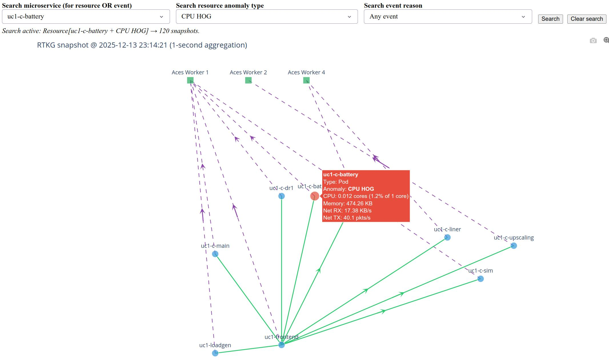

# muS-RTKG: Runtime Temporal Knowledge Graphs for Microservice Observability

**muS-RTKG** is a Kubernetes-native observability framework for microservice systems. It builds **Runtime Temporal Knowledge Graphs (RTKGs)** from resource metrics, service-to-service communication metrics, and runtime events.

The objective of muS-RTKG is to provide a unified temporal graph representation of the runtime system state. Instead of analyzing logs, metrics, traces, events, and anomaly outputs separately, muS-RTKG integrates them into time-indexed graph snapshots that support root-cause analysis, visualization, and natural-language querying.

## Framework Overview

muS-RTKG represents a running microservice system as a sequence of graph snapshots. Each snapshot captures the system state within a fixed time window.

In each RTKG snapshot:

- nodes represent microservices, pods, worker nodes, or runtime events;
- edges represent service-to-service communication, deployment relationships, or event-to-service links;
- node attributes store resource metrics, anomaly labels, and runtime metadata;
- edge attributes store request rate, latency, error rate, throughput, and communication anomaly labels;
- runtime events are linked to the affected microservices.

This temporal graph representation enables operators and analytics modules to reason about how anomalies appear, evolve, and propagate across the microservice system.

## Main Developed Components

### 1. RCA with Temporal Graph Learning

The RCA module performs root-cause analysis over sequences of RTKG-derived graphs. It identifies:

- the faulty microservice,
- the failure type,
- and top-k root-cause candidates.

The model combines graph attention and temporal sequence modeling to capture both service dependencies and anomaly evolution over time.

Folder:

```text
rca_temporal_graph_learning/
visualization/
cat > README.md <<'EOF'
# muS-RTKG: Runtime Temporal Knowledge Graphs for Microservice Observability

**muS-RTKG** is a Kubernetes-native observability framework for microservice systems. It builds **Runtime Temporal Knowledge Graphs (RTKGs)** from resource metrics, service-to-service communication metrics, and runtime events.

The objective of muS-RTKG is to provide a unified temporal graph representation of the runtime system state. Instead of analyzing logs, metrics, traces, events, and anomaly outputs separately, muS-RTKG integrates them into time-indexed graph snapshots that support root-cause analysis, visualization, and natural-language querying.

## Framework Overview

muS-RTKG represents a running microservice system as a sequence of graph snapshots. Each snapshot captures the system state within a fixed time window.

In each RTKG snapshot:

- nodes represent microservices, pods, worker nodes, or runtime events;
- edges represent service-to-service communication, deployment relationships, or event-to-service links;
- node attributes store resource metrics, anomaly labels, and runtime metadata;
- edge attributes store request rate, latency, error rate, throughput, and communication anomaly labels;
- runtime events are linked to the affected microservices.

## Main Developed Components

### 1. RCA with Temporal Graph Learning

The RCA module performs root-cause analysis over sequences of RTKG-derived graphs. It identifies the faulty microservice, the failure type, and top-k root-cause candidates.

Folder: `rca_temporal_graph_learning/`

### 2. RTKG Visualization Tool

The visualization module provides a graph-level view of RTKG snapshots. It helps operators inspect microservice nodes, communication edges, metrics, anomaly labels, runtime events, and the temporal evolution of system behavior.

Example RTKG visualization:



Folder: `visualization/`

### 3. Local LLM Interface with Temporal Graph-RAG

The LLM module provides a local natural-language interface over RTKG snapshots. It uses local LLMs served through Ollama and retrieves structured graph evidence from RTKG snapshots.

The evaluation compares Log-RAG, Latest-Snapshot Graph-RAG, and Temporal Graph-RAG.

Folder: `llm_temporal_graph_rag/`

## Repository Structure

```text
.
├── docs/
├── rtkg_generation/
├── rca_temporal_graph_learning/
├── visualization/
├── llm_temporal_graph_rag/
├── examples/
├── artifacts/
├── requirements.txt
└── README.md
